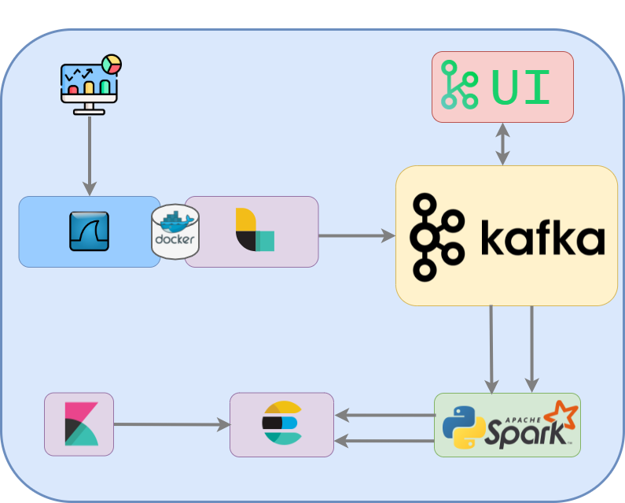

# Network-TAP-Analysis
This project was created for the TAP subject. We used the ELK stack, along with PySpark, to analyze the network traffic of a PC, using TShark, a console line version of Wireshark. Below you can find the notebook and an image that shows how the different technologies were used together

## Notebook

[Notebook here!](docs/Presetazione_Progetto.ipynb)

## Pipeline

